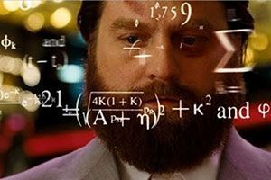

# Monitoring your systems

*Lea este documento en [español](https://github.com/peterm85/monitoring/blob/master/README.md)*

## What’s this all about?

Have you ever found yourself analyzing an elusive 'bug' while diving through endless log lines? Have you had to chronologically relate events from different services? Did this make you feel like the following character?

Don’t worry, you’re not alone.

Besides being complicated, this process can take a lot of time and become highly frustrating. Add to this the stress that emerges when the bug comes from the production environment. It hurts my head just thinking about it. 
Is there no better way to go about this? When a project grows, do companies (big or small) really have no other alternative than to increase the time and money spent on this type of task?
What if I told you that there are tools that can make your life easier and can provide super helpful information to control your applications? Would you like to be able to use a panel where you can identify problems at a glance?
Well, then keep on reading! Here, we’ll go over each step to quickly and practically convert your application into an effective monitoring system.

## Context

With any software, it is essential to know what’s happening at all times and to quickly detect when and why something isn’t working correctly. In both desktop applications and monolithic architectures, the process has always been as “simple” as checking a console or log file. But things began to get complicated with service-oriented architecture, since we had to carry out this task for each of the services that makes it up. For microservices architecture, the problem is caused by the ephemerality, scalability and modularity aspects. This is why a centralized system with which you can collect, analyze and relate data from the system is key. It allows us to interpret the operation or status of our application and makes it easier to detect errors.

## Concepts

We’ll start with reviewing some important concepts:

### The difference between Observability and Monitoring

I’m sure you’ve heard of both concepts, but a lot of people don’t really know the differences. Here are some of the nuances:
- **Observability**: According to [Wikipedia](https://en.wikipedia.org/wiki/Observability), it can be defined as: “a measure of how well internal states of a system can be inferred from knowledge of its external outputs.”
- **Monitoring**: The action of following these signals or external outputs to evaluate the state or health of a system.
They may seem similar, but we can see the differences more clearly with an analogy. Let’s say that it’s related to medicine and a patient (observable system) doesn’t tell their doctor (monitoring system) about their symptoms, diet, or behavior (signs or external outputs). That makes it difficult for the doctor to diagnose the patient’s problems effectively.

*«Monitoring tells you if the system is working. Observability allows you to ask why it’s not working.»*

Baron Schwartz

### The three pillars of observability
As you can probably tell, our systems need to have a sufficient level of observability. Next, we’ll quickly go over the main signals used:

#### Logs
Temporary records of events. The basic traceability component of a system, which allows the information, states, and context values of a given moment to be stored in a file.

*Patient: “Doctor, I haven’t been feeling well for the last few months. I’m bloated and my stomach hurts.”*

#### Metrics
Metrics are a numerical representation of data that’s been measured in time intervals. They allow us to collect a series of values of different concepts that help us run more precise queries.

*Patient: “Here you have the results of that blood test that you asked me to get.”*

#### Tracing
Traces identify the flow of events in a distributed system. Tracing allows us to distinguish the components/services involved in processes like conditions and effects that have been compiled over time.

*Patient: “Last Sunday, I was feeling great. Then, I went out for breakfast and ate a delicious bagel and my stomach started to hurt again.”*

*Doctor: “My dear patient, you may be gluten intolerant.”*

The more data we have about a system, the easier it is to detect what’s causing a problem. It’s up to systems architects to know how many signals are needed and how detailed they should be, depending on the complexity of the case.

## Index:

- [Logs](https://github.com/peterm85/monitoring/logging#README_en.md)
- Metrics
- Tracing

