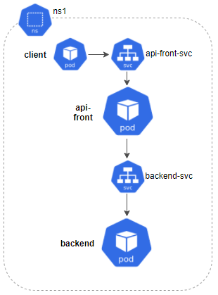
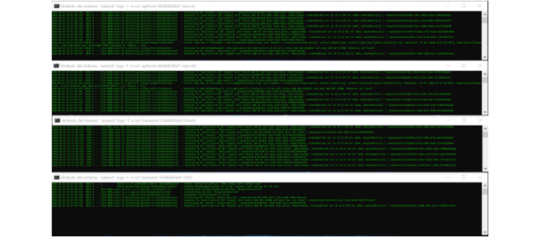
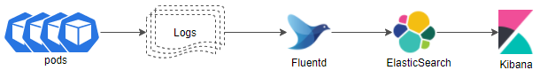
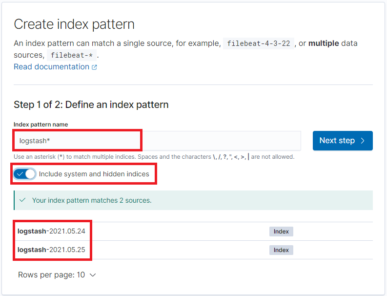
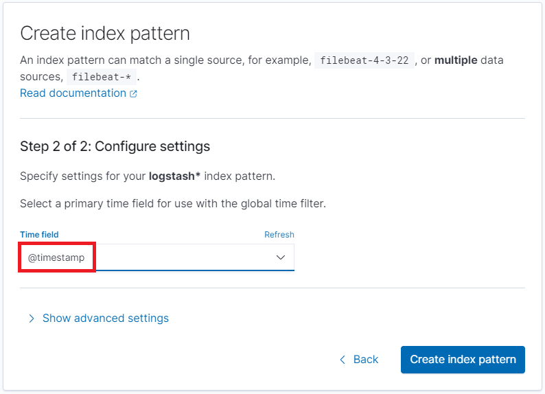
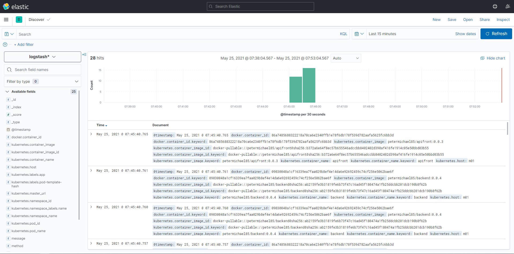
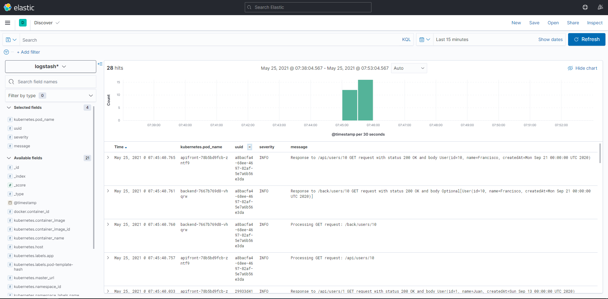
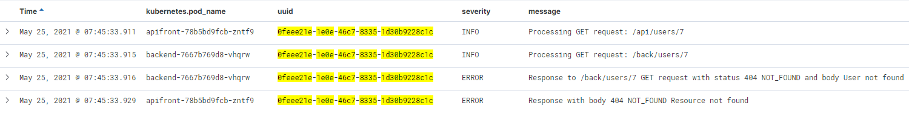
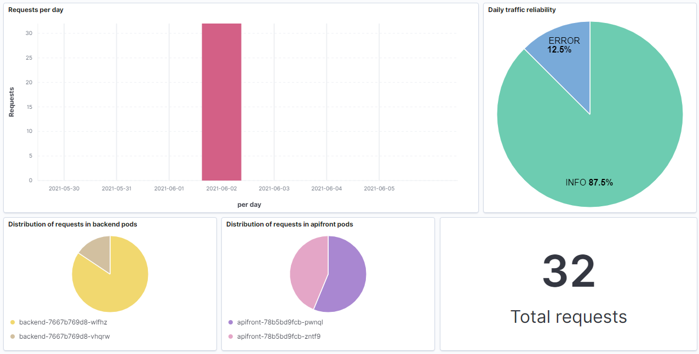
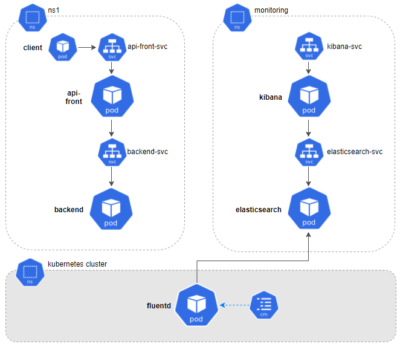

## Monitorización de logs
Como hemos visto anteriormente, los logs han sido históricamente una de las pocas vías para detectar un problema dentro de nuestra aplicación. Dada su sencillez (a simple vista no es más que un mensaje de texto) está en nuestra mano su uso correcto y eficiente. Vamos a ver algunos puntos a tener en cuenta a la hora de trabajar con logs:
- **Mensajes descriptivos**: es importante que el mensaje nos ofrezca información de calidad. De nada sirve mantener logs del tipo “pasó por aquí”.
- **Mensajes útiles**: aunque no lo parezca, escribir logs no es gratis. A nivel de rendimiento y de almacenamiento conlleva un coste (no entraremos a discutir si éste es más o menos elevado). Es por ello que deberemos elegir bien cuándo la información es útil y cuándo merece la pena imprimirla. Por ejemplo, no es muy recomendable imprimir logs en cada condición if-else sólo para seguir el flujo en una función. Si es realmente importante quizás sólo sea necesario un mensaje más descriptivo que lo resuma.
- **Buen uso de los niveles de log**: no siempre necesitamos revisar el mismo grado de detalle en los logs. Por eso es importante categorizarlos según el nivel de TRACE, DEBUG, INFO, WARN, ERROR o FATAL. Así podremos cambiar el nivel según sea necesario y evitar inundarnos de mensajes que sólo sirvan para ofuscar nuestro proceso de análisis.
- **Cuida la información sensible**: evita imprimir información sensible como datos personales, contraseñas, etc. No todo el mundo (ni siquiera aquellos que revisarán los logs) puede tener acceso a esta información. En tal caso procura anonimizarla.
- **Usa un patrón**: define una estructura de mensajes con un formato común. Esto te aportará claridad en los análisis.

A continuación vamos a proponer un caso de estudio para la monitorización de logs. Aunque el ejemplo se presenta sobre microservicios dentro de un cluster de Kubernetes, la solución propuesta no es exclusiva para este tipo de arquitecturas. Puedes beneficiarte igualmente aunque tu entorno esté basado en monolitos y/o servicios.



Como puede verse en la imagen, nuestro sistema estará compuesto por dos tipos de microservicios: api-front y backend, comunicados entre sí vía REST y ubicados en el namespace ns1. Para cada uno desplegaremos un servicio y dos réplicas. Finalmente lanzaremos una serie de peticiones desde un cliente para comprobar su comportamiento.

Imaginemos que alguno de nuestros microservicios tuviese un error. Para poder analizarlo correctamente deberíamos revisar los logs de cada componente:



(Sí, lo reconozco. Me encanta la consola con apariencia de Matrix.)

Como ya habréis imaginado, ahora deberíamos identificar fechas, relacionar peticiones y hacernos un mapa del flujo hasta llegar al error detectado.

¿Y si ahora te dijera que en lugar de dos tipos de pods se desplegarán 20, 50 ó 100?; ¿y si en lugar de dos réplicas por cada pod fuesen 10?. Resultaría mucho más complejo, ¿verdad?

## ¿Qué es EFK?
Para bien o para mal, no existe una llave ‘maestra’ que resuelva todo el problema de raíz. La solución que proponemos estará compuesta por un conjunto de herramientas que nos aportarán flexibilidad y diferentes características según necesitemos.

Llamamos EFK al conjunto de herramientas compuesto por **E**lasticSearch, **F**luentd y **K**ibana que nos ayudará a interpretar de manera conjunta todos los logs generados por los elementos de nuestro sistema.

Cada uno de ellos cumple con una función concreta:
- **ElasticSearch**: almacena los logs resultantes para realizar búsquedas más eficientes.
- **Fluentd**: recolecta, trata y envía los logs desde las diferentes fuentes de información que se configuren. 
- **Kibana**: es una interfaz gráfica desde donde poder visualizar e interpretar los datos, crear gráficos, etc.



### Requisitos
- Hardware: Intel Core i7, 16Gb RAM
- Docker v19.03.5
- Minikube v1.8.2 (con al menos 4 cpus y 4Gb de RAM)
- ElasticSearch v7.12.1
- Fluentd v1.12
- Kibana v7.12.1

### Instalación
#### ElasticSearch
ElasticSearch provee una base de datos no relacional y un motor de búsqueda donde se almacenarán los logs que vamos a recolectar. Como verás más adelante con los ejemplos, estos logs se organizan en índices o colecciones de documentos con características similares. Para aquellos que no estén familiarizados con este tipo de estructura, podríamos decir que los índices se ‘asemejan’ a las tablas de las base de datos relacionales.

Si quieres saber más, puedes encontrar información detallada en la página oficial de [elastic](https://www.elastic.co/es/what-is/elasticsearch).

Ahora bien, vamos a lo práctico. A continuación mostraremos cómo desplegar un servidor de ElasticSearch en nuestro cluster de Kubernetes.

> *elastic.yaml*

```apiVersion: apps/v1
kind: StatefulSet
metadata:
  name: elasticsearch
  namespace: monitoring
spec:
  serviceName: elasticsearch-svc
  replicas: 1
  selector:
    matchLabels:
      app: elasticsearch
  template:
    metadata:
      labels:
        app: elasticsearch
    spec:
      containers:
      - name: elasticsearch
        image: docker.elastic.co/elasticsearch/elasticsearch:7.12.1
        env:
        - name: discovery.type
          value: single-node
        ports:
        - containerPort: 9200
          name: http
          protocol: TCP
        resources:
          limits:
            cpu: 512m
            memory: 2Gi
          requests:
            cpu: 512m
            memory: 2Gi
 
---
 
apiVersion: v1
kind: Service
metadata:
  name: elasticsearch-svc
  namespace: monitoring
  labels:
    service: elasticsearch-svc
spec:
  type: NodePort
  selector:
    app: elasticsearch
  ports:
  - port: 9200
    targetPort: 9200
```

Podremos aplicar los cambios ejecutando el siguiente comando:
> ``kubectl apply -f elastic.yaml``

Vamos a comentar algunas de sus características:
- Previamente hemos creado un nuevo namespace llamado **monitoring** donde alojaremos los componentes que serán necesarios para la monitorización.
- Expondremos este componente a través de un servicio. Es importante recordar el nombre (**elasticsearch-svc**) y el puerto (**9200**) del servicio dado que vamos a tener que acceder a él desde otros componentes.
- Por último, es muy importante tener en cuenta los recursos que le asignaremos. Quizá éste sea el elemento que más requiera de ellos. Para esta prueba será más que suficiente con **2Gb** de RAM y **512m** de CPU.

Perfecto, ya tenemos una base de datos. ¿Ahora quién se encarga de alimentarla?

#### Fluentd
Se trata del agente encargado de recolectar información, en nuestro caso de los logs de Kubernetes, transformar y enviarla a ElasticSearch. Decidí trabajar con Fluentd ya que ofrece muy buen comportamiento con Kubernetes, bajo footprint, fácil configuración y gran cantidad de plugins. Sin embargo existen otras alternativas también muy utilizadas como Logstash (formando el conocido ELK) o FileBeat.
Si quieres saber más sobre [fluentd](https://docs.fluentd.org/), puedes encontrar información detallada en su página oficial.

Para comenzar, si queremos acceder a la información de Kubernetes, será necesario generar unas credenciales adecuadas mediante su correspondiente rbac (Role-based Access Control):

> *fluentd-rbac.yaml*

```
apiVersion: v1
kind: ServiceAccount
metadata:
  name: fluentd-sa
  namespace: kube-system
 
---
 
apiVersion: rbac.authorization.k8s.io/v1beta1
kind: ClusterRole
metadata:
  name: fluentd-cr
  namespace: kube-system
rules:
- apiGroups:
  - ""
  resources:
  - pods
  - namespaces
  verbs:
  - get
  - list
  - watch
 
---
 
kind: ClusterRoleBinding
apiVersion: rbac.authorization.k8s.io/v1beta1
metadata:
  name: fluentd-crb
roleRef:
  kind: ClusterRole
  name: fluentd-cr
  apiGroup: rbac.authorization.k8s.io
subjects:
- kind: ServiceAccount
  name: fluentd-sa
  namespace: kube-system
```

Una forma de asegurarnos de que siempre se mantenga ejecutándose en alguno de los nodos del cluster es desplegarlo como un DaemonSet. 
> *fluentd-daemonset.yaml*

```
apiVersion: apps/v1
kind: DaemonSet
metadata:
  name: fluentd
  namespace: kube-system
  labels:
    version: v1
    kubernetes.io/cluster-service: "true"
spec:
  selector:
    matchLabels:
      app: fluentd
  template:
    metadata:
      labels:
        version: v1
        kubernetes.io/cluster-service: "true"
        app: fluentd
    spec:
      serviceAccount: fluentd-sa
      serviceAccountName: fluentd-sa
      tolerations:
      - key: node-role.kubernetes.io/master
        effect: NoSchedule
      containers:
      - name: fluentd
        image: fluent/fluentd-kubernetes-daemonset:v1.12-debian-elasticsearch7-1
        env:
          - name:  FLUENT_ELASTICSEARCH_HOST
            value: "elasticsearch-svc.monitoring"
          - name:  FLUENT_ELASTICSEARCH_PORT
            value: "9200"
          - name: FLUENT_ELASTICSEARCH_SCHEME
            value: "http"
          - name: FLUENT_UID
            value: "0"
        resources:
          limits:
            memory: 512Mi
          requests:
            cpu: 100m
            memory: 200Mi
        volumeMounts:
        - name: varlog
          mountPath: /var/log
        - name: varlibdockercontainers
          mountPath: /var/lib/docker/containers
          readOnly: true
       - name: config-volume
          mountPath: /fluentd/etc/kubernetes.conf
          subPath: kubernetes.conf
      terminationGracePeriodSeconds: 30
      volumes:
      - name: varlog
        hostPath:
          path: /var/log
      - name: varlibdockercontainers
        hostPath:
          path: /var/lib/docker/containers
      - name: config-volume
        configMap:
        name: fluentd-config
```

Podremos aplicar los cambios con los siguientes comandos:
> ``kubectl apply -f fluentd-rbac.yaml``

> ``kubectl apply -f fluentd-daemonset.yaml``

Tal y como hicimos en el apartado anterior, vamos a comentar algunas de sus características:
- A diferencia del resto de componentes del EFK que alojaremos en el namespace monitoring, Fluentd estará alojado en el namespace de Kubernetes (**kube-system**).
- Es importante indicar el host [**FLUENT_ELASTICSEARCH_HOST**] y el puerto del servicio [**FLUENT_ELASTICSEARCH_PORT**] que definimos para ElasticSearch.
- La ruta de donde extraer los logs está indicada mediante **/var/log**.
- Hemos creado un fichero en el que describiremos las reglas de filtrado de datos y vamos a acceder a ellas a través del ConfigMap **config-volume**. Explicaremos esto más adelante.

Una vez aplicado el yaml, podremos comprobar que conectó correctamente con ElasticSearch accediendo a sus logs y revisando que se mostró el siguiente mensaje:

> ``kubectl logs fluentd-xxxx -n kube-system``

```
Connection opened to Elasticsearch cluster =>
  {:host=>"elasticsearch.logging", :port=>9200, :scheme=>"http"}
```

**Cómo filtrar los datos**:

Por el momento lo único que hemos hecho es encargar a Fluentd que recoja los logs de cada contenedor y los guarde en ElasticSearch. Este comportamiento es perfectamente válido pero poco útil.

Imaginemos Fluentd como una factoría de madera. Si aplicamos la analogía a lo explicado en el párrafo anterior, tendríamos una entrada de mercancía (troncos de árboles) y una salida exactamente igual. ¡Pues vaya factoría! Sin embargo, en la vida real no pasa esto. Los troncos son examinados para detectar el tipo de madera que se quiere trabajar, se cortan en listones e incluso se marcan para conocer su procedencia. Pues todas estas tareas pueden aplicarse en Fluentd. Vamos a ver nuestro caso:

```
kubernetes.conf : |-
    # This configuration file for Fluentd is used
    # to watch changes to Docker log files that live in the
    # directory /var/lib/docker/containers/ and are symbolically
    # linked to from the /var/log/containers directory using names that capture the
    # pod name and container name.
    
    # we select only the logs from the containers of the namespace 'ns1'
    <source>
      @type tail
      @id in_tail_container_logs
      path /var/log/containers/*ns1*.log
      pos_file /var/log/containers.log.pos
      read_from_head true
      tag kubernetes.*
      <parse>
        @type json
        time_format "%Y-%m-%dT%H:%M:%S.%NZ"
        time_type string
      </parse>
    </source>
    
    # we split all fields
    <filter kubernetes.**>
      @type parser
      key_name log
      <parse>
        @type regexp
        expression ^(?<time>.+) (?<severity>\w*) (?<pid>\d+) --- \[(?<proc>[^\]]*)\] (?<method>[^\:]*)\:(?<message>[^\|]*)\| requestUuid=(?<uuid>.+)$
        time_format "%Y-%m-%d %H:%M:%S.%N"
      </parse>
    </filter>
    
    # we use kubernetes metadata plugin to add metadatas to the log
    <filter kubernetes.**>
      @type kubernetes_metadata
    </filter>
    
    # we discard fluentd logs
    <match fluent.**>
      @type null
    </match>
```

En primer lugar hemos definido una entrada de datos <source> en la que indicaremos la procedencia de los logs que vamos a querer tratar. En nuestro caso sólo nos interesan aquellos que provengan del namespace **ns1**. A estos ficheros vamos a etiquetarlos con el prefijo ’**kubernetes.**’ para poder seleccionarlos en los posteriores pasos.
A continuación vamos a extraer sus campos mediante una expresión regular. De este modo obtendremos los valores de **time, severity, pid, proc, method, message** y **requestUuid** y en un futuro podremos realizar búsquedas, ordenaciones, etc. a partir de estos. Es importante conocer previamente el formato de nuestros logs para adaptar la expresión regular. Si tienes problemas con tu expresión regular al final del post te facilitaré una herramienta online de mucha ayuda.
Por último, incorporamos **metadatos de kubernetes** a cada registro, de modo que podamos conocer su procedencia: nombre del namespace, del pod, del contenedor, etc.
Una vez terminados estos pasos, ahora sí, los nuevos datos serán enviados a ElasticSearch.

Genial, ya tenemos también los datos. Pero, ¿cómo podemos trabajar con ellos?

#### Kibana
Es una interfaz open-source, perteneciente a Elastic, que nos permite visualizar y explorar datos que se encuentran indexados en ElasticSearch. Como comprobarás más adelante, es bastante sencilla e intuitiva de utilizar y no es necesario tener un perfil técnico para usarla. Por tanto puede ser un complemento bastante útil para descargar a los desarrolladores de un soporte de nivel 1.

Si quieres saber más, puedes encontrar información detallada en la página oficial de [kibana](https://www.elastic.co/es/kibana/features#kibana-lens).
A continuación mostraremos cómo desplegar Kibana en nuestro cluster de Kubernetes:

> *kibana.yaml*

```
apiVersion: apps/v1
kind: Deployment
metadata:
  name: kibana
  namespace: monitoring
spec:
  selector:
    matchLabels:
      app: kibana
  template:
    metadata:
      labels:
        app: kibana
    spec:
      containers:
      - name: kibana
        image: docker.elastic.co/kibana/kibana:7.12.1
        env:
        - name: ELASTICSEARCH_HOSTS
          value: http://elasticsearch-svc:9200
        - name: XPACK_SECURITY_ENABLED
          value: "true"
        ports:
        - containerPort: 5601
          name: http
          protocol: TCP
 
---
 
apiVersion: v1
kind: Service
metadata:
  name: kibana-svc
  namespace: monitoring
  labels:
    service: kibana-svc
spec:
  type: NodePort
  selector:
    app: kibana
  ports:
  - port: 5601
    targetPort: 5601
```

Podremos aplicar los cambios con el siguiente comando:
> ``kubectl apply -f kibana.yaml``

Algunas de sus características:
- Asignamos Kibana al namespace **monitoring** comentado anteriormente.
- Es importante indicar la url [**ELASTICSEARCH_HOSTS**] de acceso a ElasticSearch.
- Definimos el puerto del servicio desde donde podremos acceder a la interfaz de Kibana (**5601**).

Una vez creados todos los componentes podremos acceder a Kibana realizando un *port-forward* de su servicio y accediendo desde un navegador a la dirección http://localhost:5601.
> ``kubectl port-forward svc/kibana-svc --namespace=monitoring 5601:5601``

### Configuración
Terminada toda la instalación estarás deseando ver cómo sacarle partido. Pues ahora viene lo bueno.

En primer lugar será necesario lanzar algo de tráfico para que en ElasticSearch se generen los índices a los que vamos a acceder. A continuación, deberemos configurar éstos desde Kibana:



Por defecto los logs de cada día se guardan en un nuevo índice de ElasticSearch con el sufijo de la fecha ‘*logstash-[fecha]*’. Por lo tanto configuraremos un patrón para que tome los índices independientemente de ese sufijo.
También será importante marcar la opción ‘*Include system and hidden indices*’, ya que nos permitirá utilizar todos los campos que hemos extraído desde Fluentd.



Finalmente seleccionaremos el filtro de tiempo por defecto ‘@timestamp’.

### Búsquedas y paneles de control

Si accedemos al apartado “Discovery” de Kibana podremos ver la siguiente pantalla:



En ella tenemos acceso a los logs de todos nuestros microservicios. También se muestra un gráfico de barras con el volumen de logs recibidos por intervalos de tiempo. Finalmente, en la zona superior, tenemos un buscador desde el que realizar consultas a partir de los campos que nos interesen y seleccionar el intervalo de tiempo de la búsqueda.
Sin embargo, toda esta información aún se ve muy confusa. Vamos a crear una búsqueda en la que mostraremos sólo ciertos datos de cada registro. Por ejemplo, además de la **fecha** incorporaremos el **nombre del pod**, el **uuid de la petición**, el **nivel de log** y el **mensaje**. Para ello sólo será necesario pulsar en el icono  que aparece al lado de cada uno de ellos.



Una vez hecho esto podremos filtrar por los campos visibles de modo que podamos localizar la información que necesitemos. En este caso, si seleccionamos el **uuid** de una petición que tenga algún error , podremos identificar el flujo que ha tenido y analizar con más precisión la causa del problema.



Otras funcionalidades que ofrece Kibana son los dashboards. Con ellos podrás reunir una serie de gráficos que te ayuden a conocer el estado de tu sistema.



La interfaz es bastante intuitiva en la edición y creación de los distintos paneles y puedes generar todo tipo de gráficos, histogramas, contadores, etc. Si prefieres importar los que he ido creando, en el repositorio dejaré el fichero .ndjson con la búsqueda y el dashboard y podrás cargarla en tu entorno.

## Conclusiones
¿Realmente merece la pena invertir en estas tecnologías?; ¿compensa la relación coste-beneficio?
Las herramientas de monitorización son, desde mi punto de vista, algo fundamental en todos los sistemas. Es cierto que su implantación requiere un esfuerzo inicial para ampliar la arquitectura del sistema (en el siguiente gráfico veremos cómo queda) así como sus recursos. Sin embargo,las ventajas que ofrecen a largo plazo merecen mucho la pena:
- Control sobre lo que está pasando en tiempo real
- Agilidad en los procesos de detección de errores 
- Prevención de fallos mucho mayores
- Mejora de la eficiencia de los sistemas
- Reducción de costes
- Liberación de los desarrolladores en cuanto a soporte de nivel 1

A lo largo de mi carrera profesional he trabajado en diferentes proyectos y reconozco que hay una diferencia considerable entre realizar un *troubleshooting* de forma manual a hacerlo con ayuda de estas herramientas.



Para finalizar sólo me gustaría recordar algunos de los puntos importantes que hemos comentado al trabajar con logs:
- Define un patrón claro de lo que imprimes en tus logs para facilitar su tratamiento.
- Cuida la cantidad y la calidad de la información que imprimes. Define en qué momento es necesario aplicar los diferentes niveles de log y activa aquel que mantenga un equilibrio entre restrictivo y útil.
- Define una política de rotación de logs, cuotas, etc. de modo que el almacenamiento de estos no perjudique el rendimiento del sistema.
- Y por supuesto, evita introducir información sensible en los logs de tus aplicaciones.

*«Lo que no se define no se puede medir. Lo que no se mide, no se puede mejorar. Lo que no se mejora, se degrada siempre»*.

William Thomson Kelvin

## Recursos
- https://www.oreilly.com/library/view/distributed-systems-observability/9781492033431/ch04.html
- https://kubernetes.io/es/docs/tasks/debug-application-cluster/_print/
- https://medium.com/swlh/fluentd-simplified-eb5f19416e37
- https://rubular.com/ - Herramienta online para el diseño de expresiones regulares para fluentd