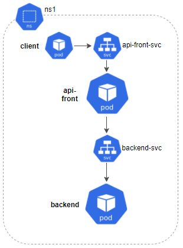
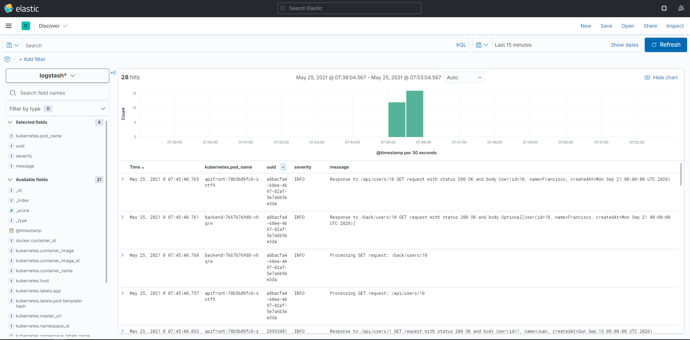
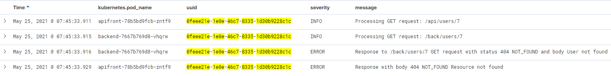

## Monitoring logs
Logs have historically been one of the few ways to detect problems within our applications. Since they are simple (they don’t look like much more than a text message), it’s on us to use them correctly and efficiently. So, here are some points to keep in mind when working with logs:
- **Descriptive messages**: The messages should offer us quality information. It makes no sense to keep irrelevant logs like “it passed through here”.
- **Useful message**: Although it may not seem like it, writing logs doesn’t come for free. It has its cost in terms of performance and storage. That’s why we should choose wisely what information is useful and when it's worth writing or appending to a file. For example, it’s not great to append the logs in each if-else condition to follow a function’s flow. If it is really important, maybe you just need to write the most descriptive message that sums it all up.
- **Proper use of log levels**: We don’t always have to review all the logs with the same amount of detail. That is why it is important to categorize them according to the level of TRACE, DEBUG, INFO, WARN, ERROR or FATAL. This way, we can change the level as needed and avoid getting flooded with messages that only serve to obfuscate our analysis.
- **Be careful with sensitive information**: Avoid writing sensitive information like personal data, passwords, etc. Not everyone (not even those who will look over the logs) should have access to this information. If they must, try to anonymize it.
- **Follow a pattern**: Define a message structure with a common format. It will help bring clarity to your analyses.

Now, we'll share a log monitoring use case. Although the example is about microservices within a Kubernetes cluster, the solution can be used for other architectures. You can even use it if your environment is based on monoliths and/or services.



As the image shows, our system will be composed of two kinds of microservices: api-front and backend, communicating with each other via REST and located in the ns1 namespace. For each one, we’ll deploy a service and two replicas. Finally, we’ll launch a series of requests from a client to check its behavior.

Let’s imagine that there was an error in one of our microservices. To correctly analyze it, we should revise the logs of each component:


(Yes, I see it too. The Matrix is everywhere.)

As you may have guessed, now we have to identify the dates, relate requests and make a flow map until we get to the error. 

And now, what if I told you that instead of the two types of pods, we can launch 20, 50 or 100? And if instead of two replicas of each pod, there were 10? That would be a lot more complicated… riiight?

## ¿What is EFK?
For better or worse, there isn’t a master key that can solve all the problems at their roots. The solution that we propose will be made up of a set of tools that will provide us with flexibility and different characteristics, depending on what we need.
We call the set of tools EFK. That’s because it’s made up of **E**lasticSearch, **F**luentd and **K**ibana, which will help us interpret all the logs generated by our system elements at once.

Each component has its own specific function:
- **ElasticSearch**: Stores the resulting logs for more efficient searches.
- **Fluentd**: Collects, processes and sends the logs from the different information sources that are configured. 
- **Kibana**: A graphical interface from which you can visualize and interpret data, create graphs, etc.


### Requirements
- Hardware: Intel Core i7, 16Gb RAM
- Docker v19.03.5
- Minikube v1.8.2 (con al menos 4 cpus y 4Gb de RAM)
- ElasticSearch v7.12.1
- Fluentd v1.12
- Kibana v7.12.1

### Installation
#### ElasticSearch
ElasticSearch provides a non-relational database and a search engine where all the logs that we collect are stored. As you’ll see a bit further on, these logs are organized in indices or collections of documents with similar characteristics. For those that aren’t familiar with this type of structure, we can say that indices “resemble” relational database tables.

If you want to learn more, you can find the detailed information here: [elastic](https://www.elastic.co/es/what-is/elasticsearch).

All right, time for the practical part. Below, we’ll show how to deploy an ElasticSearch server in our Kubernetes cluster.

> *elastic.yaml*

```apiVersion: apps/v1
kind: StatefulSet
metadata:
  name: elasticsearch
  namespace: monitoring
spec:
  serviceName: elasticsearch-svc
  replicas: 1
  selector:
    matchLabels:
      app: elasticsearch
  template:
    metadata:
      labels:
        app: elasticsearch
    spec:
      containers:
      - name: elasticsearch
        image: docker.elastic.co/elasticsearch/elasticsearch:7.12.1
        env:
        - name: discovery.type
          value: single-node
        ports:
        - containerPort: 9200
          name: http
          protocol: TCP
        resources:
          limits:
            cpu: 512m
            memory: 2Gi
          requests:
            cpu: 512m
            memory: 2Gi
 
---
 
apiVersion: v1
kind: Service
metadata:
  name: elasticsearch-svc
  namespace: monitoring
  labels:
    service: elasticsearch-svc
spec:
  type: NodePort
  selector:
    app: elasticsearch
  ports:
  - port: 9200
    targetPort: 9200
```

We can apply the changes executing the following command:
> ``kubectl apply -f elastic.yaml``

Now, we’ll touch on some of its characteristics:
- Beforehand, we created a new namespace called **monitoring** where we’ll store the components that we’ll need for monitoring.
- We’ll expose this component through a service. Make sure to remember the name (**elasticsearch-svc**) and the port (**9200**) of the service since we’ll have to access it from other components.
- Last but not least, it’s important to keep the resources that we’ll assign in mind. This might be the part with the most requirements. For this test, it will be more than enough with **2Gb** of RAM and **512m** of CPU.

Great, now we have a database. But who will feed it?

#### Fluentd
This is the agent in charge of gathering information, in our case, about the Kubernetes logs, transforming it and sending it to ElasticSearch. I decided to work with Fluentd since it’s a great complement to Kubernetes, has a low footprint, is easy to set up and has a huge range of plugin options. However, there are other common alternatives like Logstash (making up ELK) or FileBeat.
If you want to know more about Fluentd, check out the official page here: [fluentd](https://docs.fluentd.org/).

To get started, if we want to access the information from Kubernetes, we’ll have to generate the right credentials through its corresponding rbac (Role-based Access Control):

> *fluentd-rbac.yaml*

```
apiVersion: v1
kind: ServiceAccount
metadata:
  name: fluentd-sa
  namespace: kube-system
 
---
 
apiVersion: rbac.authorization.k8s.io/v1beta1
kind: ClusterRole
metadata:
  name: fluentd-cr
  namespace: kube-system
rules:
- apiGroups:
  - ""
  resources:
  - pods
  - namespaces
  verbs:
  - get
  - list
  - watch
 
---
 
kind: ClusterRoleBinding
apiVersion: rbac.authorization.k8s.io/v1beta1
metadata:
  name: fluentd-crb
roleRef:
  kind: ClusterRole
  name: fluentd-cr
  apiGroup: rbac.authorization.k8s.io
subjects:
- kind: ServiceAccount
  name: fluentd-sa
  namespace: kube-system
```

One way of making sure that it is always running in the cluster nodes is to deploy it as a  DaemonSet.

> *fluentd-daemonset.yaml*

```
apiVersion: apps/v1
kind: DaemonSet
metadata:
  name: fluentd
  namespace: kube-system
  labels:
    version: v1
    kubernetes.io/cluster-service: "true"
spec:
  selector:
    matchLabels:
      app: fluentd
  template:
    metadata:
      labels:
        version: v1
        kubernetes.io/cluster-service: "true"
        app: fluentd
    spec:
      serviceAccount: fluentd-sa
      serviceAccountName: fluentd-sa
      tolerations:
      - key: node-role.kubernetes.io/master
        effect: NoSchedule
      containers:
      - name: fluentd
        image: fluent/fluentd-kubernetes-daemonset:v1.12-debian-elasticsearch7-1
        env:
          - name:  FLUENT_ELASTICSEARCH_HOST
            value: "elasticsearch-svc.monitoring"
          - name:  FLUENT_ELASTICSEARCH_PORT
            value: "9200"
          - name: FLUENT_ELASTICSEARCH_SCHEME
            value: "http"
          - name: FLUENT_UID
            value: "0"
        resources:
          limits:
            memory: 512Mi
          requests:
            cpu: 100m
            memory: 200Mi
        volumeMounts:
        - name: varlog
          mountPath: /var/log
        - name: varlibdockercontainers
          mountPath: /var/lib/docker/containers
          readOnly: true
       - name: config-volume
          mountPath: /fluentd/etc/kubernetes.conf
          subPath: kubernetes.conf
      terminationGracePeriodSeconds: 30
      volumes:
      - name: varlog
        hostPath:
          path: /var/log
      - name: varlibdockercontainers
        hostPath:
          path: /var/lib/docker/containers
      - name: config-volume
        configMap:
        name: fluentd-config
```

We can apply the changes with the following commands:
> ``kubectl apply -f fluentd-rbac.yaml``
> ``kubectl apply -f fluentd-daemonset.yaml``

Just like with ElasticSearch, we’ll discuss some of its characteristics:
- As opposed to the rest of the EFK components that we’ll store in the namespace monitoring,  Fluentd will be stored in the Kubernetes namespace (**kube-system**).
- It’s important to indicate the host [**FLUENT_ELASTICSEARCH_HOST**] and the service port [**FLUENT_ELASTICSEARCH_PORT**] that we’ll define for ElasticSearch.
- The route to extract the logs is indicated via **/var/log**.
- We’ve created a file where we’ll describe the rules for data filtering and we’ll be able to access them through ConfigMap **config-volume**. We’ll explain this more in-depth later on.

Once the yaml is applied,  we can check to make sure that it properly connected to  ElasticSearch by going to its logs to see if we can find the following message:

> ``kubectl logs fluentd-xxxx -n kube-system``

```
Connection opened to Elasticsearch cluster =>
  {:host=>"elasticsearch.logging", :port=>9200, :scheme=>"http"}
```

**How to filter the data:**

For now, the only thing we’ve done is put Fluentd in charge of gathering the logs of each container and saving them in ElasticSearch. This behavior is totally valid but pretty useless.

Let’s think of Fluentd as if it were a wood factory. If we apply this analogy to what we just explained, we would get a shipment of merchandise (tree trunks) and then just ship out the exact same untouched wood. What a factory! But, obviously, that’s not what happens in real life. The trunks are examined to see what type of wood they are, they’re cut into lumber and are labeled so you can keep track of what it is/where it came from. Tasks like these can be done in Fluentd. Let’s go back to our case:

```
kubernetes.conf : |-
    # This configuration file for Fluentd is used
    # to watch changes to Docker log files that live in the
    # directory /var/lib/docker/containers/ and are symbolically
    # linked to from the /var/log/containers directory using names that capture the
    # pod name and container name.
    
    # we select only the logs from the containers of the namespace 'ns1'
    <source>
      @type tail
      @id in_tail_container_logs
      path /var/log/containers/*ns1*.log
      pos_file /var/log/containers.log.pos
      read_from_head true
      tag kubernetes.*
      <parse>
        @type json
        time_format "%Y-%m-%dT%H:%M:%S.%NZ"
        time_type string
      </parse>
    </source>
    
    # we split all fields
    <filter kubernetes.**>
      @type parser
      key_name log
      <parse>
        @type regexp
        expression ^(?<time>.+) (?<severity>\w*) (?<pid>\d+) --- \[(?<proc>[^\]]*)\] (?<method>[^\:]*)\:(?<message>[^\|]*)\| requestUuid=(?<uuid>.+)$
        time_format "%Y-%m-%d %H:%M:%S.%N"
      </parse>
    </filter>
    
    # we use kubernetes metadata plugin to add metadatas to the log
    <filter kubernetes.**>
      @type kubernetes_metadata
    </filter>
    
    # we discard fluentd logs
    <match fluent.**>
      @type null
    </match>
```

First of all, we’ve defined a  <source> data entry where we can indicate where the logs that we’re dealing with came from. In our case, we’re only interested in those that come from the namsepace **ns1**. We’ll label these files with the ’**kubernetes.**’ prefix so we can select them in the next steps.
Next, we’ll extract their fields using a regular expression. This will allow us to get the **time, severity, pid, proc, method, message** and **requestUuid** values. In the future, we’ll be able to search for them, organize them, etc. from the data. It’s important for you to already know the format or the logs to adapt the regular expression. If you have any problems with your regular expression, at the end of this post you’ll find a link to a tool that will be very helpful.
Finally, we incorporate the **metadatos de kubernetes** to each record, so we know where it came from: the name of the namespace, the pod, container, etc.
Once we’ve finished these steps, we can send our new data to ElasticSearch.

Fantastic, now we have the data. But how can we work with it?

#### Kibana
An open-source interface that belongs to Elastic. It allows us to visualize and explore the data that’s indexed in ElasticSearch. As you’ll see, it’s quite simple and intuitive to use and you don’t need technical expertise. That’s why it can be a pretty useful complement to download for developers with level 1 support.

If you want to learn more, you can get more detailed information in the official page of [kibana](https://www.elastic.co/es/kibana/features#kibana-lens).
Now, we’ll show you how we deploy Kibana in our Kubernetes cluster:

> *kibana.yaml*

```
apiVersion: apps/v1
kind: Deployment
metadata:
  name: kibana
  namespace: monitoring
spec:
  selector:
    matchLabels:
      app: kibana
  template:
    metadata:
      labels:
        app: kibana
    spec:
      containers:
      - name: kibana
        image: docker.elastic.co/kibana/kibana:7.12.1
        env:
        - name: ELASTICSEARCH_HOSTS
          value: http://elasticsearch-svc:9200
        - name: XPACK_SECURITY_ENABLED
          value: "true"
        ports:
        - containerPort: 5601
          name: http
          protocol: TCP
 
---
 
apiVersion: v1
kind: Service
metadata:
  name: kibana-svc
  namespace: monitoring
  labels:
    service: kibana-svc
spec:
  type: NodePort
  selector:
    app: kibana
  ports:
  - port: 5601
    targetPort: 5601
```

We can apply the changes with the following command:
> ``kubectl apply -f kibana.yaml``

Some of its characteristics:
- We’ll assign Kibana to the **monitoring** namespace.
- Make sure to indicate the access url [**ELASTICSEARCH_HOSTS**] to ElasticSearch.
- We’ll define the service port from which we can access the Kibana interface (**5601**).

Once all the components are created, we can access Kibana by *port-forward* its service and going to the address http://localhost:5601 from a browser.
> ``kubectl port-forward svc/kibana-svc --namespace=monitoring 5601:5601``

### Set up
Now that the installation is finished, I’m sure you want to know how to make the most of this tool. Here’s where it gets good.

First of all, we’ll have to launch some traffic so that the indices that we’re going to access are generated in ElasticSearch. Then, we should configure them from Kibana:


By default, each day’s logs are saved in a new ElasticSearch index with a suffix of the date: ‘*logstash-[fecha]*’. With this, we’ll configure a pattern to take the indices independently of the suffix.
It’s also important to check the option ‘*Include system and hidden indices*’, since it will allow us to use all of the fields that we’ve extracted from Fluentd.


Finally, we’ll select the time filter by default ‘@timestamp’.

### Search and dashboards

If we go to the “Discovery” section in Kibana, we’ll see the following:


Here, we have access to all our microservices logs. It also shows a bar graph with the volume of logs received over time intervals. Finally, up top, we have a search function where we can make queries with the fields that we’re interested in and select the time interval of the search.
But all of this information is still quite confusing. We’re going to create a search where we’ll just show certain data from each registry. For example, besides the **data** we’ll add the **name of the pod**, the **uuid of the request**, the **log level** and the **message**. To do that, you just have to click on the icon  that appears next to each one of them.



Once we’ve done that, we can filter by the visible fields so that we can find the information that we want. In our case, if we click on the **uuid** of a request with an error , we can identify its flow and analyze the source of the problem with more precision.



Kibana also has dashboards. They allow us to gather a series of graphics that help us understand the state of our system.


The interface is intuitive when it comes to editing and creating the different dashboards. You can also generate all different types of graphics, histograms, containers, etc. If you prefer to import what I’ve been creating, I’ll leave the file .ndjson in the repository with the search and dashboard so you can load it in your environment.

## Conclusions
Is it really worth investing in these technologies? Does the cost outweigh the benefit?
From my point of view, monitoring tools are fundamental for all systems. It’s true that getting them all set up requires some initial work to amplify the system architecture (in the following graphic, you’ll see how it ends up) and its resources. However, the advantages in the long term are well worth it:
- Control over what’s happening in real time
- Agility in error detection processes
- Nip errors in the bud before you have a bigger problem on your hands
- Improves the efficiency of systems
- Saves time and money
- Frees up developers in terms of level 1 support
Throughout my professional career, I’ve worked on many projects. I know all too well that there’s a huge difference between manual troubleshooting and doing it with these tools.


To conclude, I’d just like to remind you about some important points that we’ve mentioned about working with logs.
- Define a clear pattern for what you’ll write in your logs to make them easy to deal with.
- Be mindful of the quantity and quality of the information that you write or append. Define the moments when it's necessary to apply different log levels and activate those that can strike a balance between restrictive and useful.
- Define a policy of rotation for logs, quotas, etc. so that you don’t overload storage and harm system performance.
- And, of course, don’t include sensitive information in your application logs.

*«What is not measured, cannot be improved. What is not improved is always degraded.»*
Lord William Thomson Kelvin

## Resources
- https://www.oreilly.com/library/view/distributed-systems-observability/9781492033431/ch04.html
- https://kubernetes.io/es/docs/tasks/debug-application-cluster/_print/
- https://medium.com/swlh/fluentd-simplified-eb5f19416e37
- https://rubular.com/ - Online tool to design regular expressions for Fluentd